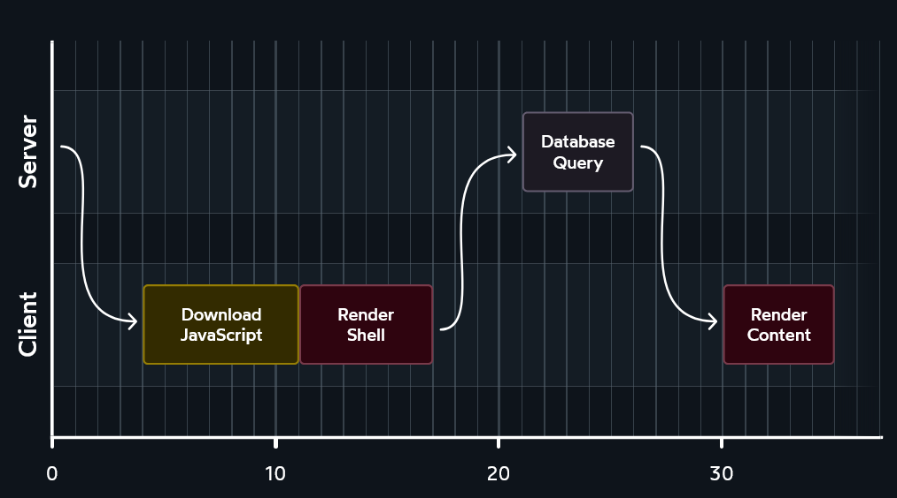
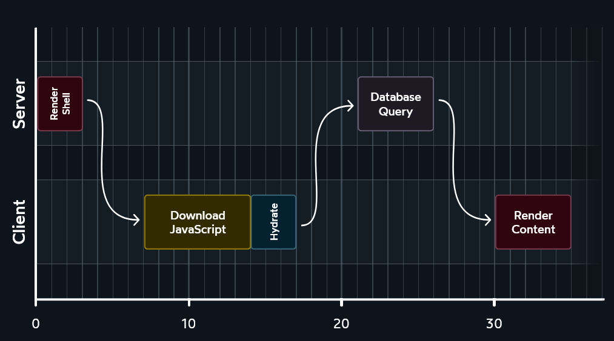

## React history

React is more than 10 years old!

<kc-timeline events='[{ "year": 2013, "caption": "React 🎂", "description": "The first release of React was in May 2013." }, {"year": 2016,"caption": "Next.js SSR","description": "Next.js Server-Side Rendering (SSR) was introduced in 2016. It enables rendering React components on the server side, improving performance and SEO by delivering fully rendered pages to the client"},{ "year": 2019, "caption": "React Hooks", "description": "React Hooks were introduced in React version 16.8.0, which was released in February 2019. They provide a new way to use stateful logic and side effects in functional components." }, { "year": 2020, "caption": "Next.js RSC", "description": "Next.js Runtime Script Configuration (RSC) support was introduced in 2020. It allows dynamic modification of the Next.js runtime configuration without requiring a server restart." }]'></kc-timeline>

---

## React history in code

<div class="kc-columns kc-gap2">
<div>

##### React class component

```jsx [|5-9|5-9,19-21|5-9,19-21,13|]
class Posts extends React.Component {
  state = { posts: [] };

  componentDidMount() {
    fetch('http://jsonplaceholder.typicode.com/posts', {
      signal: this.abortController.signal,
    })
      .then((response) => response.json())
      .then((posts) => this.setState({ posts }));
  }

  componentUnmount() {
    this.abortController.abort();
  }

  render() {
    return (
      <ul>
        {this.state.posts.map((post) => (
          <li>{post.title}</li>
        ))}
      </ul>
    );
  }
}
```

<!-- .element class="xs" -->

</div>
<div class="fragment">

##### React hooks

```jsx []
function Posts() {
  const [posts, setPosts] = useState([]);

  useEffect(() => {
    const abortController = new AbortController();
    fetch('http://jsonplaceholder.typicode.com/posts', {
      signal: abortController.signal,
    })
      .then((response) => response.json())
      .then((posts) => setPosts(posts));

    return () => abortController.abort();
  }, []);

  return (
    <ul>
      {posts.map((post) => (
        <li>{post.title}</li>
      ))}
    </ul>
  );
}
```

<!-- .element class="xs" -->

</div>
</div>

```jsx
// Use like this
ReactDOM.render(<Posts />, document.getElementById('root'));
```

<!-- .element class="xs" -->

---

### Without SSR



<!-- .element class="img-react-dark" -->

source: https://www.joshwcomeau.com/react/server-components/

<!-- .element class="source" -->

<!-- .slide: class="is-empty react-dark" -->

Without server-side rendering, the client waits for the server to respond before it can render.

---

### With SSR



<!-- .element class="img-react-dark" -->

source: https://www.joshwcomeau.com/react/server-components/

<!-- .element class="source" -->

<!-- .slide: class="is-empty react-dark" -->

With server-side rendering, the server sends a fully rendered page to the client, which can render it immediately.

---

### Comparison

With SSR

- Get first paint sooner
- "Hydration" is needed for interactivity
  - This calls the server again to get the same data
- Run _the same code twice_, once on the server and once on the client

🤔 Why hit the same server twice?

<!-- .element class="fragment" -->
