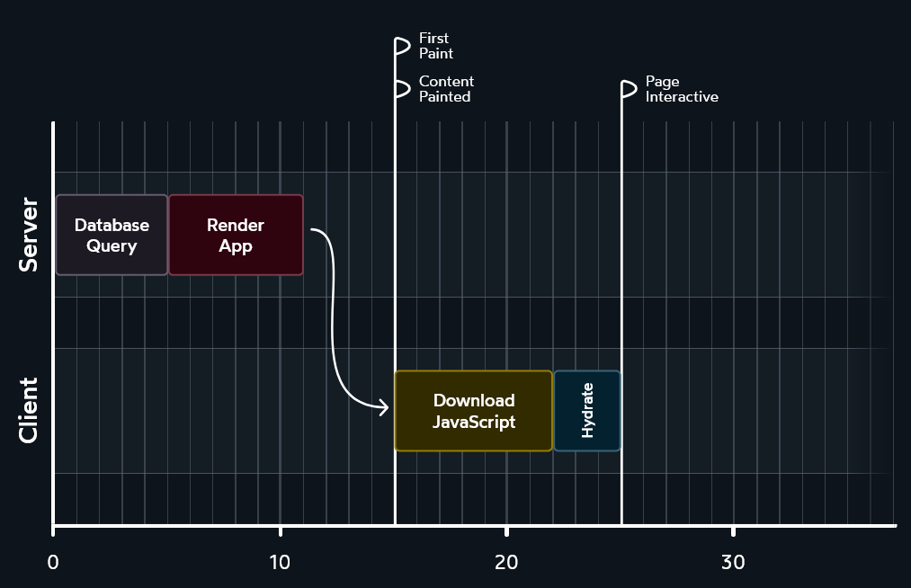

## With RSC



<!-- .element class="img-react-dark" -->

source: https://www.joshwcomeau.com/react/server-components/

<!-- .element class="source" -->

With react server components, the data is loaded once on the server and then sent to the client.

<!-- .slide: class="is-empty react-dark" -->

---

### Remember this?

```jsx []
function Posts() {
  const [posts, setPosts] = useState([]);
  useEffect(() => {
    const abortController = new AbortController();
    fetch('http://jsonplaceholder.typicode.com/posts', {
      signal: abortController.signal,
    })
      .then((response) => response.json())
      .then((posts) => setPosts(posts));

    return () => abortController.abort();
  }, []);

  return (
    <ul>
      {posts.map((post) => (
        <li>{post.title}</li>
      ))}
    </ul>
  );
}
```

<!-- .element class="kc-smallest" -->

<!-- .slide: data-auto-animate -->

---

### Remember this?

```jsx []
export async function Posts() {
  const response = await fetch("http://jsonplaceholder.typicode.com/posts");
  const posts = await response.json();

  return (
    <ul>
      {posts.map((post) => (
        <li key={post.title}>{post.title}</li>
      ))}
    </ul>
  );
}
```

<!-- .element class="kc-smallest" -->

<!-- .slide: data-auto-animate -->

🤯 

<!-- .element style="font-size: 3em; text-align: center" class="fragment" -->